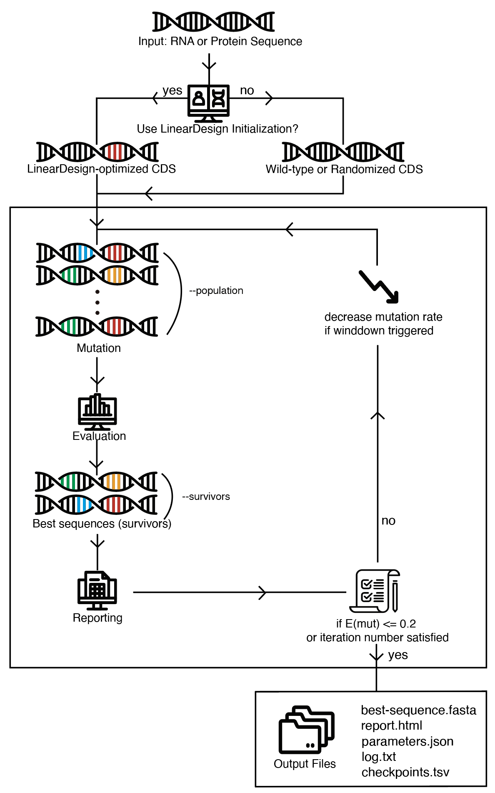

******************
How VaxPress Works
******************

------------
Optimization
------------

.. index:: Genetic Algorithm

VaxPress utilizes a genetic algorithm to produce an optimized mRNA
CDS sequence. It initiates a collection of randomly mutated child
sequences based on the CDS sequence. The number of these sequences
is determined by the ``--population`` parameter. Subsequently, scoring
functions evaluate these sequences. A selection process then
identifies the fittest sequences, which are carried forward to the
next generation. The number of these survivors is defined by the
``--survivors`` parameter.

In the following iteration, these survivor sequences produce new
offspring sequences under a pre-defined mutation rate. This process
persists for a specified number of iterations, set by the ``--iterations``
parameter. Over hundreds to thousands of these cycles, the sequence
population progressively evolves towards the optimal coding sequences,
exhibiting improved fitness with each iteration.

------------------
Objective Function
------------------

The objective function is a linear combination of the factors below,
with associated weights. It is represented as follows:

.. math:: \textup{maximize}\ Fitness(s) =  \Sigma_{f \in factors} weight_{f} \cdot metric_{f}(s)

Refer to the :doc:`scoring_functions` section for more details on
each factor.

.. index:: Winddown Trigger, Winddown Rate
.. _label_WinddownTR:

-----------------------------------
Adaptive Decrement of Mutation Rate
-----------------------------------

To achieve the best results, generating new populations that can
effectively compete with their predecessors is essential. As the
optimization process progresses, new populations with many mutations
may not be selected due to their predecessors' high fitness. If the
fitness score remains constant despite ongoing optimization, reducing
the mutation rate to enhance the existing population is necessary.
The ``--winddown-trigger`` parameter is the count of iterations
with a constant fitness score that necessitates a decrease in the
mutation rate. The ``--winddown-rate`` parameter is the factor by
which the mutation rate is reduced when the winddown is activated.
