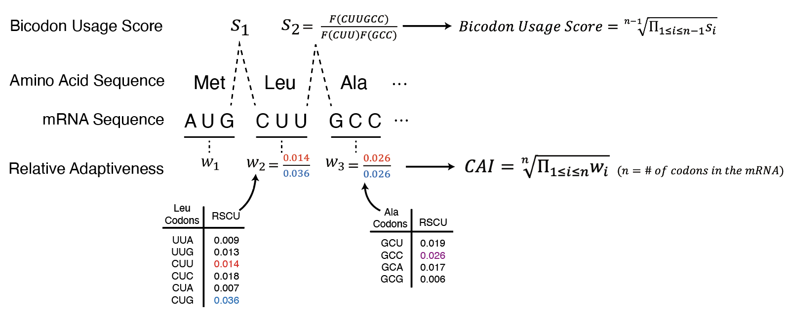

*****************
Scoring Functions
*****************

The fitness of a sequence is determined through a linear combination
of metrics, which are computed by various scoring functions. Each
scoring function yields two numerical values per evaluation: a
*metric* and a *score.* The *metric* serves as a reference value
that illustrates the sequence's optimality according to a particular
characteristic. It is primarily designed for human interpretation
and appears in reports and logs. On the other hand, the *score*
forms a component of the fitness function, where a higher number
corresponds to greater optimality. The balance between the scoring
functions is tuned through their weights, which can be adjusted
using command line options.

.. index:: Objective Function
.. index:: Scoring Function

VaxPress comes with a variety of integrated scoring functions. These
functions enable optimization with considerations of RNA stability,
translation efficiency, and ease of development and manufacturing.
VaxPress also provides an add-on system to create and use your
scoring functions. This allows you to drive the sequence to include
any features you desire.

The following sections will explain the rationale and context behind
these built-in scoring functions.

.. index:: Codon Usage
.. index:: Bicodon Usage
.. index:: CAI
.. index:: Codon Adaptation Index

---------------------
Codon Usage Functions
---------------------

Codon usage bias refers to difference of frequency of synonymous
codons in coding seqeuence. It is well known that the stability
of mRNA within cells and the amount of protein produced are
significantly improved depending on the types of synonymous codons
actually composing the CDS\ [#CAI]_ [#Presnyak2015]_. Since
VaxPress' main goal
is to recommend best sequence for mRNA vaccine development, it's
rational to reflect actual *in vivo* frequency of codon usage.

============================
Codon Adaptation Index (CAI)
============================

Codon Adaptation Index is measure of codon usage bias. It calculates
similarity between synonymous codon usage of test seqeunce and
synonymous codon freqency of reference sequence. Especially,
relative synonymous codon usage (RSCU) is needed to calculate CAI.
RSCU is the ratio of the observations of a given codon calculated
with respect to the sum of all observations of codons in highly
expressed gene. VaxPress uses relative adaptiveness of
codon (:math:`w_{ij}`) as score of each codon, which is calculated
as below.

.. math:: w_{ij} = RSCU_{ij}/RSCU_{i\;max}

where :math:`w_{ij}` is relative adaptiveness and :math:`RSCU_{ij}`
is RSCU value of jth codon for ith amino acid. And :math:`RSCU_{i\;max}`
is maximal RSCU value of ith amino acid among synonymous codons\ [#CAI]_.

Then VaxPress obtain the average of these codon by codon values.

=============
Bicodon Usage
=============

It is well known that not only the frequency of usage of individual
codons but also the frequency of consecutive codon occurrences
significantly impacts gene design. VaxPress reads the sequence in
codon units, obtaining scores which is calculated as below.

.. math:: score = {log {F(ABCDEF) \over F(ABC)F(DEF)}}

(where *ABCDEF* is example codon pair and *F(ABC)* is frequency of
codon *ABC*.)\ [#CoCoPUTs]_

Then VaxPress obtain the average of these codon by codon values.
In addition, raw data of codon RSCU values and codon pair score is
obtained from CoCoPUTs codon usage database\ [#CoCoPUTs]_.

.. index:: RNA Folding
.. index:: MFE
.. index:: Minimum Free Energy
.. index:: Start Codon Structure
.. index:: Loop Length
.. index:: Stem Length

-----------
RNA Folding
-----------

For the development of stable mRNA vaccines, the structural stability
of RNA is crucial. In other words, it is favorable for the structures
to be as limited in diversity as possible. So VaxPress has considered
this as an objective and incorporated scoring factors.

=========================
Minimum Free Energy (MFE)
=========================

Minimum Free Energy represents the free energy of RNA
when it forms the most stable structure. Finding RNA sequence which
is corresponding to predicted MFE is common strategy for vaccine
development\ [#Zuker1981]_ [#Hofacker2014]_. To calculate MFE value,
VaxPress uses the *ViennaRNA* and *LinearFold* as folding engines.

In detail, *ViennaRNA* employs dynamic programming techniques to
compute the MFE structure of an RNA sequence with time complexity
of cubic time for length of CDS. On the other side, *LinearFold*
utilizes a linear-time dynamic programming approach, which significantly
reduces the time complexity compared to more traditional dynamic
programming methods. It considers different types of base pairs
and loop structures to estimate the MFE structure efficiently.

Since *ViennaRNA* and *LinearFold* use different algorithm to
estimate MFE, VaxPress offers both as a options for folding engine.

=====================
Start Codon Structure
=====================

Stem-loop structure near start codon is highly influential to RNA's
translational efficiency. It's because tranlation initiation is
affected a lot by mRNA's secondary structure. Since actual proteins
translated from mRNA vaccine matters, efficient translation is much
more important\ [#Mauger2019]_ [#Kearse2019]_.

In this section, the length of the stem formed near the start codon
of RNA is measured and reflected as a score.

==================================
Loop Length (total unpaired bases)
==================================

Shorter loops in RNA generally contribute to more stable secondary
structures due to reduced entropic costs and decreased structural
variability. Thus, loop is usually considered to predict nucleic
secondary structure stabilities\ [#Tinoco1999]_ [#NNDB]_. Moreover,
highly folded secondary structures with more base pairing inhibits
mRNA hydrolysis,
while unpaired bases are more susceptible for degradation. [#WS2021]_
Thus, minimizing the total number of unpaired bases (which corresponds
to minimizing loop length) will improve *in vitro* stability of the
mRNA.

In VaxPress, we added *Loop Length* function as an alternative
quantification method for mRNA stability besides MFE. In this
function, the length of all segments considered to have unfolded
loop structures are summed to calculate score.

===========
Stem Length
===========

One of the points to be careful about in the development of mRNA
vaccines is that vaccine materials could be recognized as foreign
substances, potentially triggering an immune response in our bodies.
In relation to this, our bodies have a system called pattern
recognition receptors (PRRs)\ [#Janeway1989]_. These are receptors that recognize
patterns commonly present in various antigens coming from the
outside. Among them, MDA5 (Melanoma differentiation-associated
gene-5), for instance, recognizes and breaks down viral double-stranded
RNA which is represented as long stem in cells\ [#Berke2012]_ [#Wu2013]_.

In the secondary structure of mRNA vaccines, the stem region
corresponds to this case. To prevent its breakdown, limitations on
stem length have been established.

.. image:: _images/stem_loop.png
    :width: 700px
    :align: center
    :alt: stem-loop structure

.. index:: iCodon-Predicted Stability, U Count, DegScore

-------------------
Sequential Features
-------------------

This area includes various factors that influence RNA sequence
stability and immunogenicity in cells, such as:

==========================
iCodon-Predicted Stability
==========================

``iCodon`` is program that predicts the stability of the coding
sequence of RNA using synonymous codons based on machine learning
model trained by mRNA stability profiles from zebrafish and Xenopus
embryos, human cell lines, and mouse embryonic stem cells\ [#Diez2022]_.

In VaxPress, this is considered as an optimization factor for
conducting sequence optimization. Particularly, it is regarded in
terms of the predicted *in vivo* stability of RNA secondary structure
to propose the optimal RNA sequence.

=============
Uridine Count
=============

RNA molecules that are extensively folded induce a severe interferon
response, and a significant contributing factor to this is the
number of uridines in the sequence. Therefore, when developing
vaccines replacing uridine (U) to modified base such as
N1-methylpsedouridine (Ψ)\ [#Kariko2008]_, is used. Also, alternative
strategy that minimize the number of uridines might be
helpful\ [#Vaidyanathan2018]_.

Building upon this fact, VaxPress choses second strategy. It counts
the number of uridines as it seeks sequences that minimize the
uridine count.

========
DegScore
========

DegScore is the deep learning model devolped by Eterna. It predicts
possibility for degradation of RNA from the sequence information.
Unlike the usage of DegScore in Eterna's original projects, VaxPress
utilizes DegScore function by dividing its value by length of
CDS\ [#Leppek2022]_.

.. index:: Local GC Ratio, Repeat Length

----------------------------------------
Features related to effective production
----------------------------------------

==============
Local GC Ratio
==============

The production of mRNA vaccines is carried out through in vitro
transcription. For this purpose, it's necessary to synthesize
template DNA corresponding to the desired sequence. During this
process, if the GC ratio is high, the DNA being synthesized has a
potential to form stem-loop structures on its own, which can hinder
the synthesis. Additionally, high GC content can significantly
impede the amplification process that follows. Therefore, for the
ease of vaccine production, maintaining a relatively low GC ratio
is desirable.

VaxPress calculates the existence ratio of G and C within the window
by moving it by the stride size, and then transform the window-specific
GC ratio values (``gc``) using the following equation to determine
the score.

.. math:: score = -\Sigma_{gc}(10^{log_2(|gc-0.5|)+0.05})

=============
Repeat Length
=============

For the mass production of mRNA vaccines, cloning using plasmids
is necessary. This is achieved through the synthesis of the target
sequence and vector. If the target sequence itself contains numerous
tandem repeats, difficulties arise in this synthesis and assembly
process. Therefore, it is important to proceed in a way that
minimizes this issue.

In VaxPress, tandem repeats are quantified by measuring their length.
By using ``pytrf.GTRFinder``, VaxPress finds all generic tandem
repeats from given sequences. And add all of their lengths.

----------
References
----------

.. [#CAI] Sharp, P.M. and Li, W.H. The codon Adaptation Index--a measure
   of directional synonymous codon usage bias, and its potential applications.
   *Nucleic Acids Res* 1987;15(3):1281-1295.

.. [#Presnyak2015] Presnyak, V., *et al.* Codon optimality is a major
   determinant of mRNA stability. *Cell* 2015;160(6):1111-1124.

.. [#CoCoPUTs] Alexaki, A., *et al.* Codon and Codon-Pair Usage Tables
   (CoCoPUTs): Facilitating Genetic Variation Analyses and Recombinant
   Gene Design. *J Mol Biol* 2019;431(13):2434-2441.

.. [#Zuker1981] Zuker, M. and Stiegler, P. Optimal computer folding of
   large RNA sequences using thermodynamics and auxiliary information.
   *Nucleic Acids Res* 1981;9(1):133-148.

.. [#Hofacker2014] Hofacker, I.L. Energy-directed RNA structure prediction.
   *Methods Mol Biol* 2014;1097:71-84.

.. [#Mauger2019] Mauger, D.M., *et al.* mRNA structure regulates protein
   expression through changes in functional half-life. *Proc Natl
   Acad Sci USA* 2019;116(48):24075-24083.

.. [#Kearse2019] Kearse, M.G., *et al.* Ribosome queuing enables non-AUG
   translation to be resistant to multiple protein synthesis inhibitors.
   *Genes Dev* 2019;33(13-14):871-885.

.. [#Tinoco1999] Tinoco, I., Jr. and Bustamante, C. How RNA folds.
   *J Mol Biol* 1999;293(2):271-281.

.. [#NNDB] Turner, D.H. and Mathews, D.H. NNDB: the nearest neighbor
   parameter database for predicting stability of nucleic acid secondary
   structure. *Nucleic Acids Res* 2010;38(Database issue):D280-282.

.. [#WS2021] Wayment-Steele, H.K., *et al.* Theoretical basis for
   stabilizing messenger RNA through secondary structure design.
   *Nucleic Acids Res* 2021;49(18):10604-10617.

.. [#Janeway1989] Janeway, C.A., Jr. Approaching the asymptote?
   Evolution and revolution in immunology. *Cold Spring Harb Symp
   Quant Biol* 1989;54 Pt 1:1-13.

.. [#Berke2012] Berke, I.C. and Modis, Y. MDA5 cooperatively forms
   dimers and ATP-sensitive filaments upon binding double-stranded
   RNA. *EMBO J* 2012;31(7):1714-1726.

.. [#Wu2013] Wu, B., *et al.* Structural basis for dsRNA recognition,
   filament formation, and antiviral signal activation by MDA5.
   *Cell* 2013;152(1-2):276-289.

.. [#Diez2022] Diez, M., *et al.* iCodon customizes gene expression
   based on the codon composition. *Sci Rep* 2022;12(1):12126.

.. [#Kariko2008] Kariko, K., *et al.* Incorporation of pseudouridine
   into mRNA yields superior nonimmunogenic vector with increased
   translational capacity and biological stability.
   *Mol Ther* 2008;16(11):1833-1840.

.. [#Vaidyanathan2018] Vaidyanathan, S., *et al.* Uridine Depletion
   and Chemical Modification Increase Cas9 mRNA Activity and Reduce
   Immunogenicity without HPLC Purification. *Mol Ther Nucleic Acids*
   2018;12:530-542.

.. [#Leppek2022] Leppek, K., *et al.* Combinatorial optimization of
   mRNA structure, stability, and translation for RNA-based
   therapeutics. *Nat Commun* 2022;13(1):1536.
