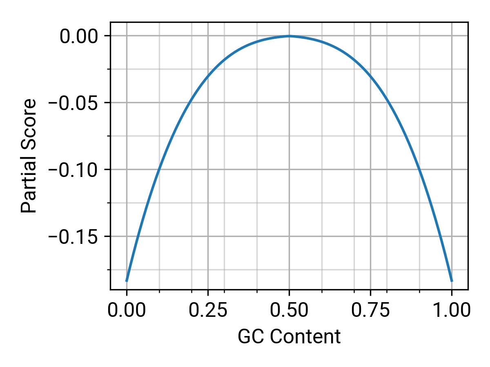

*****************
Scoring Functions
*****************

The fitness of a sequence is determined through a linear combination
of metrics, which are computed by various scoring functions. Each
scoring function yields two numerical values per evaluation: a
*metric* and a *score.* The *metric* serves as a reference value
that illustrates the sequence's optimality according to a particular
characteristic. It is primarily designed for human interpretation
and appears in reports and logs. On the other hand, the *score*
forms a component of the fitness function, where a higher number
corresponds to greater optimality. The balance between the scoring
functions is tuned through their weights, which can be adjusted
using command line options.

.. index:: Objective Function
.. index:: Scoring Function

VaxPress comes with a variety of integrated scoring functions. These
functions enable optimization with considerations of RNA stability,
translation efficiency, and ease of development and manufacturing.
VaxPress also provides an add-on system to create and use your
scoring functions. This allows you to drive the sequence to include
any features you desire.

The following sections will explain the rationale and context behind
these built-in scoring functions.

.. index:: RNA Folding
.. index:: MFE
.. index:: Minimum Free Energy
.. index:: Start Codon Structure
.. index:: Loop Length
.. index:: Stem Length

-----------
RNA Folding
-----------

The secondary structure of an mRNA vaccine plays a crucial role in
determining RNA stability and translation
efficiency\ [#Mauger2019]_:sup:`,`\ [#Leppek2022]_. The base-pairing
status determines the susceptibility to ribonucleases or divalent
metal ions, which can degrade the RNA. Additionally, local structures
near the start codon influence the efficiency of translation
initiation.

Predicting this secondary structure, however, is a computationally
intensive task due to its cubic complexity. VaxPress is designed
to handle this prediction task efficiently by utilizing all available
CPU cores. Following the prediction, individual score functions are
executed to evaluate the optimality of the predicted structures for
use as a vaccine sequence.

=========================
Minimum Free Energy (MFE)
=========================

|:wrench:| :ref:`Options related to Minimum Free Energy <options-MFE>`

Minimum Free Energy represents the free energy of RNA
when it forms the most stable structure. Finding RNA sequence which
is corresponding to predicted MFE is common strategy for vaccine
development\ [#Zuker1981]_ [#Hofacker2014]_. To calculate MFE value,
VaxPress uses the *ViennaRNA* and *LinearFold* as folding engines.

In detail, *ViennaRNA* employs dynamic programming techniques to
compute the MFE structure of an RNA sequence with time complexity
of cubic time for length of CDS. On the other side, *LinearFold*
utilizes a linear-time dynamic programming approach, which significantly
reduces the time complexity compared to more traditional dynamic
programming methods. It considers different types of base pairs
and loop structures to estimate the MFE structure efficiently.

Since *ViennaRNA* and *LinearFold* use different algorithm to
estimate MFE, VaxPress offers both as a options for folding engine.

==================================
Loop Length (total unpaired bases)
==================================

|:wrench:| :ref:`Options related to Loop Length <options-loops>`

Shorter loops in RNA generally contribute to more stable secondary
structures due to reduced entropic costs and decreased structural
variability. Thus, loop is usually considered to predict nucleic
secondary structure stabilities\ [#Tinoco1999]_ [#NNDB]_. Moreover,
highly folded secondary structures with more base pairing inhibits
mRNA hydrolysis,
while unpaired bases are more susceptible for degradation. [#WS2021]_
Thus, minimizing the total number of unpaired bases (which corresponds
to minimizing loop length) will improve *in vitro* stability of the
mRNA.

In VaxPress, we added *Loop Length* function as an alternative
quantification method for mRNA stability besides MFE. In this
function, the length of all segments considered to have unfolded
loop structures are summed to calculate score.

=====================
Start Codon Structure
=====================

|:wrench:| :ref:`Options related to Start Codon Structure <options-startstr>`

Stem-loop structure near start codon is highly influential to RNA's
translational efficiency. It's because tranlation initiation is
affected a lot by mRNA's secondary structure. Since actual proteins
translated from mRNA vaccine matters, efficient translation is much
more important\ [#Mauger2019]_ [#Kearse2019]_.

In this section, the length of the stem formed near the start codon
of RNA is measured and reflected as a score.

===========
Stem Length
===========

|:wrench:| :ref:`Options related to Stem Length <options-longstems>`

One of the points to be careful about in the development of mRNA
vaccines is that vaccine materials could be recognized as foreign
substances, potentially triggering an immune response in our bodies.
In relation to this, our bodies have a system called pattern
recognition receptors (PRRs)\ [#Janeway1989]_. These are receptors that recognize
patterns commonly present in various antigens coming from the
outside. Among them, MDA5 (Melanoma differentiation-associated
gene-5), for instance, recognizes and breaks down viral double-stranded
RNA which is represented as long stem in cells\ [#Berke2012]_ [#Wu2013]_.

In the secondary structure of mRNA vaccines, the stem region
corresponds to this case. To prevent its breakdown, limitations on
stem length have been established.

Mention about DNA synthesis difficulties.

.. image:: _images/stem_loop.png
    :width: 700px
    :align: center
    :alt: stem-loop structure

.. index:: Codon Usage
.. index:: Bicodon Usage
.. index:: CAI
.. index:: Codon Adaptation Index

-----------
Codon Usage
-----------

Codon usage bias refers to the discrepancies in the frequency of
synonymous codons within a coding sequence. This bias can significantly
influence the stability of mRNA in cells and the quantity of protein
produced\ [#CAI]_:sup:`,`\ [#Presnyak2015]_. In the case of mRNA vaccines,
where antigen production takes place within the cells of the human
recipient, it is generally a safe strategy to align the codon
frequencies with those found in the human transcriptome.

============================
Codon Adaptation Index (CAI)
============================

|:wrench:| :ref:`Options related to Codon Adaptation Index <options-CAI>`

The Codon Adaptation Index (CAI) measures the similarity between
the codon usage in a given sequence and a reference sequence\ [#CAI]_.
The relative adaptiveness of each codon is calculated based on the
the frequency of a specific codon to the most frequently used
synonymous codon in highly expressed genes. The score for each
codon, :math:`w_{i}`, is defined as follows:

.. math:: w_{i} = \frac{f_{i}}{\max{f_{i}}}

where :math:`f_{i}` is the number of observations for codon :math:`i` in
the reference sequence, and :math:`\max{f_{i}}` is the number of
observations for the most frequently used synonymous codon in the
reference sequence. The CAI is then calculated as the geometric
mean of the relative adaptiveness of all codons in the sequence.

.. math:: CAI = \sqrt[n]{\prod_{j=1}^{n} w_{j}}

where :math:`n` is the number of codons in the sequence.

=============
Bicodon Usage
=============

|:wrench:| :ref:`Options related to Bicodon Usage <options-bicodon>`

In addition to the biased use of individual codons, the frequency
of consecutive codon occurrences is also known to be significantly
biased in highly expressed genes in all three kingdoms of
life\ [#Tats2008]_. To account for this, the bicodon usage score is
designed to match the codon pair frequencies in the transcriptome
of the target species The score is calculated as follows:

.. math:: w_{ABC,DEF} = {\log \frac {f_{ABC,DEF}} {f_{ABC} \cdot f_{DEF}}}

where :math:`ABC,DEF` represents a codon pair, while :math:`F(ABC)`
denotes the frequency of the individual codon :math:`ABC` within
the reference sequence.

The bicodon adaptation score, :math:`w_{ABC,DEF}`, is
standardized to fit within a specific range for easier interpretation
before being integrated into the final sequence score.

.. image:: _images/cai_bicodon.png
    :width: 700px
    :align: center
    :alt: bicodon usage.

The score is calculated using a table prepared from the CoCoPUTs
codon usage database\ [#CoCoPUTs]_.

.. index:: iCodon-Predicted Stability, U Count, DegScore

----------------------
Other Activity Factors
----------------------

Besides RNA secondary structure and codon usage bias, various other
sequence properties can influence the overall efficacy of an mRNA
vaccine. These properties impact the stability of the vaccine both
in solution and within cells, as well as its exposure to interferon
responses. The functions summarized in this section aim to enhance
the anticipated effectiveness of mRNA vaccines by optimizing those
predictive factors.

========
DegScore
========

|:wrench:| :ref:`Options related to DegScore <options-DegScore>`

`DegScore <https://zenodo.org/record/7130659>`_, a ridge regression
model, predicts the degradation rate of each base position in
solution, reflecting both primary and secondary
structures\ [#Leppek2022]_. It was trained using high-throughput
degradation profiles from hundreds of mRNA sequences under moderate
and harsh degradation conditions. In VaxPress, the reported metric
is the average DegScore across all positions.

==========================
iCodon-Predicted Stability
==========================

|:wrench:| :ref:`Options related to iCodon-Predicted Stability <options-iCodon>`

`iCodon <https://github.com/santiago1234/iCodon/>`_ is a codon
optimization tool that enhances the predicted in-cell stability,
drawing from high-throughput half-life measurements of endogenous
mRNAs\ [#Diez2022]_. The prediction model primarily relies on the
rare codon usage, contingent on the total CDS length. VaxPress
integrates iCodon's in-cell stability prediction as a scoring
function, in addition to other optimization factors. iCodon's current
human prediction model is based on SLAM-seq data obtained from K562
cells\ [#MedinaMunoz2021]_.

=============
Uridine Count
=============

|:wrench:| :ref:`Options related to Uridine Count <options-ucount>`

*N*:sup:`1`-methylpseudouridine is a modification universally employed
in the initial FDA-approved mRNA vaccines that effectively addressed
the SARS-CoV-2 pandemic. This modification, which substitutes
uridines with *N*:sup:`1`-methylpseudouridine, dramatically improves
mRNA vaccines' translational efficiency and stability\ [#Kariko2008]_.
It is thought to alter the action of some pattern recognition
receptors or interferon response factors to the mRNA.

Interestingly, depleting uridine improves the translational capacity
and decreases excessive immunogenicity for mRNAs, irrespective of
the uridine modification to N1-methylpseudouridine\ [#Vaidyanathan2018]_.
VaxPress tries to reduce the presence of uridines by substituting
them with synonymous codons that contain fewer uridines.

Similarly, VaxPress offers an alternative feature that specifically
reduces the number of uridines in loops rather than their total
count. This function is based on the observation that uridines in
loops are the most vulnerable to degradation\ [#Leppek2022]_.
For more details, please refer to the relevant section.

.. index:: Local GC Ratio, Repeat Length

------------------
Production Factors
------------------

Working with a codon-optimized CDS necessitates gene synthesis,
typically achieved through chemical oligonucleotide synthesis and
*in vitro* assembly. However, factors like repeats and GC content
can complicate this procedure, increasing the likelihood of errors
and reducing productivity. The scoring functions described in this
section mitigate the potential issues by penalizing the problematic
sequences.

================
Local GC Content
================

|:wrench:| :ref:`Options related to Local GC Ratio <options-gc>`

Steps in gene synthesis often encounter issues with GC-rich regions.
These complications can interfere with the synthesis and amplification
of high-GC sections, causing researchers to spend additional time
troubleshooting, subsequently extending the overall development
period. To mitigate these challenges, VaxPress calculates the GC
content within specified intervals and widths of the sequence. The
metric is determined from the sum of each bin's score, with the
highest score assigned to a GC ratio of 50% and lower scores given
to more biased content. The plot below illustrates the partial score
function calculated for each bin.

=============
Repeat Length
=============

|:wrench:| :ref:`Options related to Repeat Length <options-repeats>`

The presence of tandem repeats or inverted repeats interferes with
virtually every step in gene synthesis, cloning, and manipulation.
The repeat length function penalizes detected tandem repeats to
minimize the appearance of such repeats in the sequence. Currently,
VaxPress utilizes `pytrf <https://github.com/lmdu/pytrf>`_'s
``GTRFinder`` to detect tandem repeats. The metric is determined
by the total length of all tandem repeats detected by ``GTRFinder``
that surpass a specified threshold.  This approach ensures a more
streamlined and error-free process in the development and manufacturing
of vaccines.

----------
References
----------

.. [#CAI] Sharp, P.M. and Li, W.H. The codon Adaptation Index--a measure
   of directional synonymous codon usage bias, and its potential applications.
   *Nucleic Acids Res* 1987;15(3):1281-1295.

.. [#Presnyak2015] Presnyak, V., *et al.* Codon optimality is a major
   determinant of mRNA stability. *Cell* 2015;160(6):1111-1124.

.. [#Tats2008] Tats, A., Tenson, T. and Remm, M. Preferred and avoided
   codon pairs in three domains of life. *BMC Genomics* 2008;9:463.

.. [#CoCoPUTs] Alexaki, A., *et al.* Codon and Codon-Pair Usage Tables
   (CoCoPUTs): Facilitating Genetic Variation Analyses and Recombinant
   Gene Design. *J Mol Biol* 2019;431(13):2434-2441.

.. [#Mauger2019] Mauger, D.M., *et al.* mRNA structure regulates protein
   expression through changes in functional half-life. *Proc Natl
   Acad Sci USA* 2019;116(48):24075-24083.

.. [#Leppek2022] Leppek, K., *et al.* Combinatorial optimization of
   mRNA structure, stability, and translation for RNA-based
   therapeutics. *Nat Commun* 2022;13(1):1536.

.. [#Zuker1981] Zuker, M. and Stiegler, P. Optimal computer folding of
   large RNA sequences using thermodynamics and auxiliary information.
   *Nucleic Acids Res* 1981;9(1):133-148.

.. [#Hofacker2014] Hofacker, I.L. Energy-directed RNA structure prediction.
   *Methods Mol Biol* 2014;1097:71-84.

.. [#Kearse2019] Kearse, M.G., *et al.* Ribosome queuing enables non-AUG
   translation to be resistant to multiple protein synthesis inhibitors.
   *Genes Dev* 2019;33(13-14):871-885.

.. [#Tinoco1999] Tinoco, I., Jr. and Bustamante, C. How RNA folds.
   *J Mol Biol* 1999;293(2):271-281.

.. [#NNDB] Turner, D.H. and Mathews, D.H. NNDB: the nearest neighbor
   parameter database for predicting stability of nucleic acid secondary
   structure. *Nucleic Acids Res* 2010;38(Database issue):D280-282.

.. [#WS2021] Wayment-Steele, H.K., *et al.* Theoretical basis for
   stabilizing messenger RNA through secondary structure design.
   *Nucleic Acids Res* 2021;49(18):10604-10617.

.. [#Janeway1989] Janeway, C.A., Jr. Approaching the asymptote?
   Evolution and revolution in immunology. *Cold Spring Harb Symp
   Quant Biol* 1989;54 Pt 1:1-13.

.. [#Berke2012] Berke, I.C. and Modis, Y. MDA5 cooperatively forms
   dimers and ATP-sensitive filaments upon binding double-stranded
   RNA. *EMBO J* 2012;31(7):1714-1726.

.. [#Wu2013] Wu, B., *et al.* Structural basis for dsRNA recognition,
   filament formation, and antiviral signal activation by MDA5.
   *Cell* 2013;152(1-2):276-289.

.. [#Diez2022] Diez, M., *et al.* iCodon customizes gene expression
   based on the codon composition. *Sci Rep* 2022;12(1):12126.

.. [#MedinaMunoz2021] Medina-Munoz, S.G., *et al.* Crosstalk between
   codon optimality and cis-regulatory elements dictates mRNA
   stability. *Genome Biol* 2021;22(1):14.

.. [#Kariko2008] Kariko, K., *et al.* Incorporation of pseudouridine
   into mRNA yields superior nonimmunogenic vector with increased
   translational capacity and biological stability.
   *Mol Ther* 2008;16(11):1833-1840.

.. [#Vaidyanathan2018] Vaidyanathan, S., *et al.* Uridine Depletion
   and Chemical Modification Increase Cas9 mRNA Activity and Reduce
   Immunogenicity without HPLC Purification. *Mol Ther Nucleic Acids*
   2018;12:530-542.
