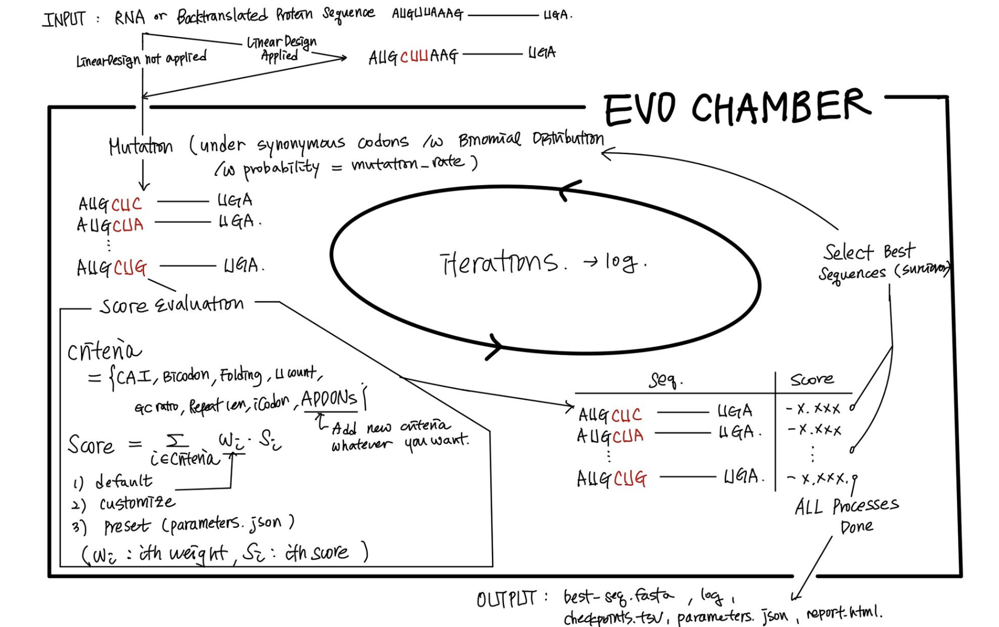
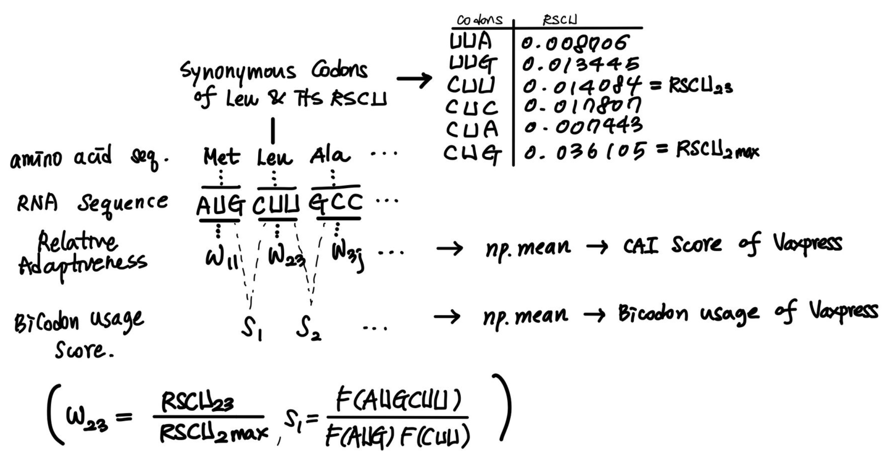
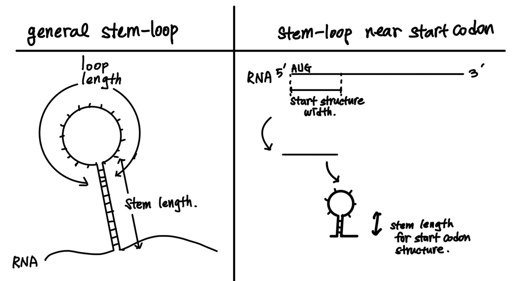

Algorithmic Details of VaxPress
********************************
-----------------
Overall algorithm
-----------------
Vaxpress uses genetic algorithm to produce optimized mRNA cds sequence, while fitness evaluation metrics are defined as scoring functions. Current scoring functions consider both the features involved in the production and distribution process, as well as features affecting the efficacy *in vivo* such as immunogenecity and translational efficiency.

If the input sequence is a protein, it will first be backtranslated into an RNA sequence.
The initial population of RNA sequences generates randomly mutated "offspring" sequences, 
up to a certain number of offspring specified as ``--population``. 
These sequences are then evaluated using scoring functions. 
Based on the evaluation results, a selection process is carried out to choose survivor sequences, with the number of survivors specified as ``--survivors``. 
From the chosen survivor sequences, new offspring sequences are produced once again. 
This iterative process is repeated for a certain number of iterations specified as ``--iterations``.

*잘 보이게 block diagram으로 개정 (논문 겸용)

-------------------------------
Composition of Scoring Function
-------------------------------

Each scoring functions of VaxPress outputs scores in the direction they want to maximize. 
Balance among the scoring functions is adjusted by their relative weights. 
The ultimate goal of the optimization process is to maximize the objective function, which is defined by the weighted sum of all the scoring functions.

====================
Objective Function
====================

The objective function is a linear combination of the factors below, with associated weights. It is represented as follows:

.. math:: Scoring \, Function =  \Sigma_{f \in factors} f*weight

VaxPress' scoring function consists of three main areas, each considering factors that can influence the optimization result:

====================
1. Codon Usage
====================

Codon usage bias refers to difference of frequency of synonymous codons in coding seqeuence.
It is well known that the stability of mRNA within cells and the amount of protein produced are significantly improved depending on the types of synonymous codons actually composing the CDS [1]_ [2]_. 
Since VaxPress’ main goal is to recommend best sequence for mRNA vaccine development, it’s rational to reflect actual *in Vivo* frequency of codon usage. 

- **CAI (Codon Adaptation Index):** 
  Codon Adaptation Index is measure of codon usage bias. It calculates similarity between synonymous codon usage of test seqeunce and synonymous codon freqency of reference sequence. 
  Especially, relative synonymous codon usag (RSCU) is needed to calculate CAI. RSCU is the ratio of the observations of a given codon calculated with respect to the sum of all observations of codons in highly expressed gene. 
  Vaxpress uses relative adaptiveness of codon(:math:`w_{ij}`) as score of each codon, which is calculated as below.

  .. math:: w_{ij} = RSCU_{ij}/RSCU_{i\;max}

  (where :math:`w_{ij}` is relative adaptiveness and :math:`RSCU_{ij}` is RSCU value of jth codon for ith amino acid. And :math:`RSCU_{i\;max}` is maximal RSCU value of ith amino acid among synonymous codons.) [1]_

  Then VaxPress obtain the average of these codon by codon values.

- **Bicodon Usage:** 
  It is well known that not only the frequency of usage of individual codons but also the frequency of consecutive codon occurrences significantly impacts gene design. 
  VaxPress reads the sequence in codon units, obtaining scores which is calculated as below.

  .. math:: score = {log {F(ABCDEF) \over F(ABC)F(DEF)}}

  (where *ABCDEF* is example codon pair and *F(ABC)* is frequency of codon *ABC*.) [3]_

  Then VaxPress obtain the average of these codon by codon values. In addition, raw data of codon RSCU values and codon pair score is obtained from CoCoPUTs codon usage database. It’s automatically generated by ``prepare-codon-usage.py``,  ``prepare-bicodon-usage.py`` [3]_

====================
2. RNA Folding
====================

For the development of stable mRNA vaccines, the structural stability of RNA is crucial. 
In other words, it is favorable for the structures to be as limited in diversity as possible. 
So VaxPress has considered this as an objective and incorporated scoring factors. 

- **predicted MFE (Minimum Free Energy):** 
  MFE (a.k.a. Minimum Free Energy) represents the free energy of RNA when it forms the most stable structure. 
  Finding RNA sequence which is corresponding to predicted MFE is common strategy for vaccine development. [4]_ [5]_
  To calculate MFE value, VaxPress uses the *ViennaRNA* and *LinearFold* as folding engines. 

  In detail, *ViennaRNA* employs dynamic programming techniques to compute the MFE structure of an RNA sequence with time complexity of cubic time for length of CDS.
  On the other side, *LinearFold* utilizes a linear-time dynamic programming approach, which significantly reduces the time complexity compared to more traditional dynamic programming methods. 
  It considers different types of base pairs and loop structures to estimate the MFE structure efficiently.

  Since *ViennaRNA* and *LinearFold* use different algorithm to estimate MFE, Vaxpress offers both as a options for folding engine.

- **Start Codon Structure:**
  Stem-loop structure near start codon is highly influential to RNA’s translational efficiency. 
  It’s because tranlation initiation is affected a lot by mRNA’s secondary structure. 
  Since actual proteins translated from mRNA vaccine matters, efficient translation is much more important. [6]_ [7]_

  In this section, the length of the stem formed near the start codon of RNA is measured and reflected as a score.

- **Loop Length (total unpaired bases):** 
  Shorter loops in RNA generally contribute to more stable secondary structures due to reduced entropic costs and decreased structural variability. 
  Thus, loop is usually considered to predict nucleic secondary structure stabilities. [8]_ [9]_
  Moreover, highly folded secondary structures with more base pairing inhibits mRNA hydrolysis, while unpaired bases are more susceptible for degradation. [10]_
  Thus, minimizing the total number of unpaired bases (which corresponds to minimizing loop length) will improve *in vitro* stability of the mRNA. 
  
  In VaxPress, we added *Loop Length* function as an alternative quantification method for mRNA stability besides MFE.
  In this function, the length of all segments considered to have unfolded loop structures are summed to calculate score.

- **Stem Length:** 
  One of the points to be careful about in the development of mRNA vaccines is that vaccine materials could be recognized as foreign substances, potentially triggering an immune response in our bodies. 
  In relation to this, our bodies have a system called pattern recognition receptors (PRRs). [11]_
  These are receptors that recognize patterns commonly present in various antigens coming from the outside. 
  Among them, MDA5 (Melanoma differentiation-associated gene-5), for instance, recognizes and breaks down viral double-stranded RNA which is represented as long stem in cells. [12]_ [13]_

  In the secondary structure of mRNA vaccines, the stem region corresponds to this case. To prevent its breakdown, limitations on stem length have been established.

===========================
3. Sequential Features
===========================
This area includes various factors that influence RNA sequence stability and immunogenicity in cells, such as:

- **iCodon-Predicted Stability:** 
  ``iCodon`` is program that predicts the stability of the coding sequence of RNA using synonymous codons based on machine learning model trained by mRNA stability profiles from zebrafish and Xenopus embryos, human cell lines, and mouse embryonic stem cells. [14]_

  In VaxPress, this is considered as an optimization factor for conducting sequence optimization. 
  Particularly, it is regarded in terms of the predicted *in vivo* stability of RNA secondary structure to propose the optimal RNA sequence.

- **U Count:**
  RNA molecules that are extensively folded induce a severe interferon response, and a significant contributing factor to this is the number of uridines in the sequence. 
  Therefore, when developing vaccines replacing uridine(U) to modified base such as psedouridine(Ψ) [15]_, is used. Also, alternative strategy that minimize the number of uridines might be helpful. [16]_

  Building upon this fact, VaxPress choses second strategy. It counts the number of uridines as it seeks sequences that minimize the uridine count.

- **DegScore:**
  DegScore is the deep learning model devolped by Eterna. It predicts possibility for degradation of RNA from seqeunce.
  Unlike the usage of DegScore in Eterna’s original projects, VaxPress utilizes DegScore function by  dividing its value by length of CDS. [17]_

=============================================
4. Features related to effective production
=============================================
- **Local GC Ratio:** 
  The production of mRNA vaccines is carried out through in vitro transcription. 
  For this purpose, it's necessary to synthesize template DNA corresponding to the desired sequence. 
  During this process, if the GC ratio is high, the DNA being synthesized has a potential to form stem-loop structures on its own, which can hinder the synthesis. 
  Additionally, high GC content can significantly impede the amplification process that follows. 
  Therefore, for the ease of vaccine production, maintaining a relatively low GC ratio is desirable.

  VaxPress calculates the existence ratio of G and C within the window by moving it by the stride size, 
  and then transform the window-specific GC ratio values (``gc``) using the following equation to determine the score.

  .. math:: score = -\Sigma_{gc}(10^{log_2(|gc-0.5|)+0.05})

- **Repeat Length:** 
  For the mass production of mRNA vaccines, cloning using plasmids is necessary. 
  This is achieved through the synthesis of the target sequence and vector. If the target sequence itself contains numerous tandem repeats, difficulties arise in this synthesis and assembly process. 
  Therefore, it is important to proceed in a way that minimizes this issue.

  In VaxPress, tandem repeats are quantified by measuring their length. 
  By using ``pytrf.GTRFinder``, Vaxpress finds all generic tandem repeats from given sequences. And add all of their lengths. 

.. _label_WinddownTR:
--------------------------
Winddown Trigger and Rate
--------------------------
To improve optimization performance, it is crucial to create new populations that can compete effectively with previous generations.
As the optimization process progresses, highly mutated new populations are less likely to be selected because the earlier sequences are already well-optimized.
Therefore, if the current fitness score remains at a certain level even as optimization continues, it is necessary to *winddown* the mutation rate.
In VaxPress, the Winddown Trigger represents the number of iterations with the same fitness score required to decrease the mutation rate, and the Winddown Rate is the factor by which the mutation rate is multiplied when the winddown is triggered.

-----------
References
-----------

.. [1] Sharp, Paul M., and Wen-Hsiung Li. "The codon adaptation index-a measure of directional synonymous codon usage bias, and its potential applications." Nucleic acids research 15.3 (1987): 1281-1295.
   
.. [2] Presnyak, Vladimir, et al. "Codon optimality is a major determinant of mRNA stability." *Cell* 160.6 (2015): 1111-1124.
   
.. [3] Alexaki, Aikaterini, et al. "Codon and codon-pair usage tables (CoCoPUTs): facilitating genetic variation analyses and recombinant gene design." *Journal of molecular biology* 431.13 (2019): 2434-2441.
   
.. [4] Zuker, Michael, and Patrick Stiegler. "Optimal computer folding of large RNA sequences using thermodynamics and auxiliary information." *Nucleic acids research* 9.1 (1981): 133-148.
   
.. [5] Hofacker, Ivo L. "Energy-directed RNA structure prediction." *RNA Sequence, Structure, and Function: Computational and Bioinformatic Methods* (2014): 71-84.
   
.. [6] Mauger, David M., et al. "mRNA structure regulates protein expression through changes in functional half-life." *Proceedings of the National Academy of Sciences* 116.48 (2019): 24075-24083.
   
.. [7] Kearse, Michael G., et al. "Ribosome queuing enables non-AUG translation to be resistant to multiple protein synthesis inhibitors." *Genes & development* 33.13-14 (2019): 871-885.
   
.. [8] Tinoco Jr, Ignacio, and Carlos Bustamante. "How RNA folds." *Journal of molecular biology* 293.2 (1999): 271-281.
   
.. [9]  Turner, Douglas H., and David H. Mathews. "NNDB: the nearest neighbor parameter database for predicting stability of nucleic acid secondary structure." *Nucleic acids research* 38.suppl_1 (2010): D280-D282.

.. [10] Hannah K Wayment-Steele et al. “Theoretical basis for stabilizing messenger RNA through secondary structure design.” Nucleic Acids Research 49. 18 (2021): 10604–10617

.. [11] aneway, Charles A. "Approaching the asymptote? Evolution and revolution in immunology." Cold Spring Harbor symposia on quantitative biology. Vol. 54. Cold Spring Harbor Laboratory Press, 1989.

.. [12] Berke, Ian C., and Yorgo Modis. "MDA5 cooperatively forms dimers and ATP‐sensitive filaments upon binding double‐stranded RNA." *The EMBO journal* 31.7 (2012): 1714-1726.
    
.. [13] Wu, Bin, et al. "Structural basis for dsRNA recognition, filament formation, and antiviral signal activation by MDA5." *Cell* 152.1 (2013): 276-289.
    
.. [14] Diez, Michay, et al. "iCodon customizes gene expression based on the codon composition." *Scientific Reports* 12.1 (2022): 12126.
    
.. [15] Karikó, Katalin, et al. "Incorporation of pseudouridine into mRNA yields superior nonimmunogenic vector with increased translational capacity and biological stability." *Molecular therapy* 16.11 (2008): 1833-1840.
    
.. [16] Vaidyanathan, Sriram, et al. "Uridine depletion and chemical modification increase Cas9 mRNA activity and reduce immunogenicity without HPLC purification." *Molecular Therapy-Nucleic Acids* 12 (2018): 530-542.

.. [17] Leppek, Kathrin, et al. "Combinatorial optimization of mRNA structure, stability, and translation for RNA-based therapeutics." Nature communications 13.1 (2022): 1536.